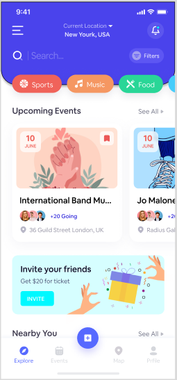
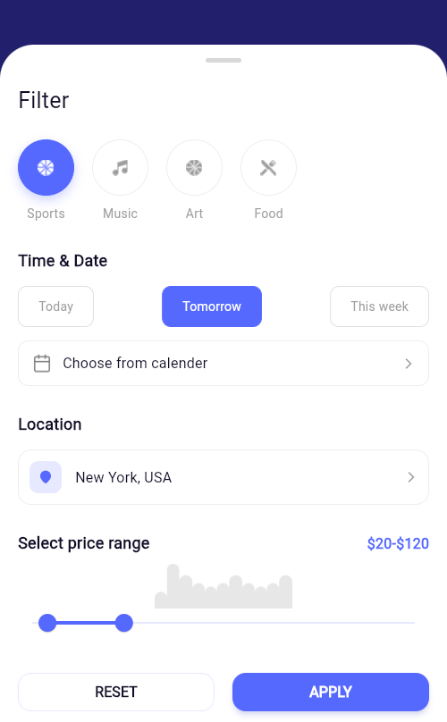
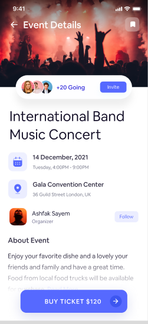
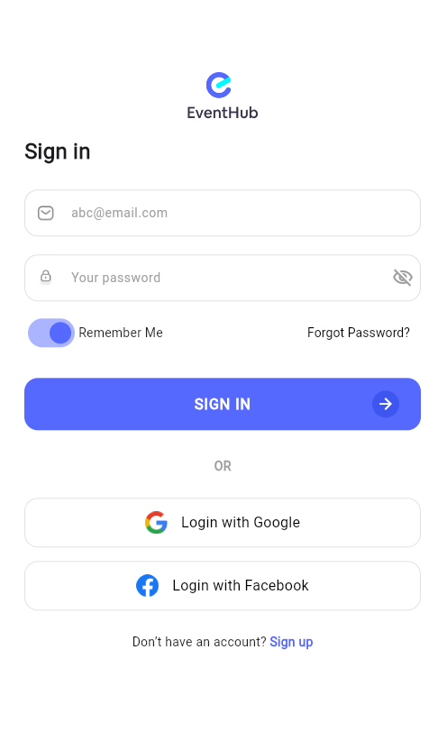
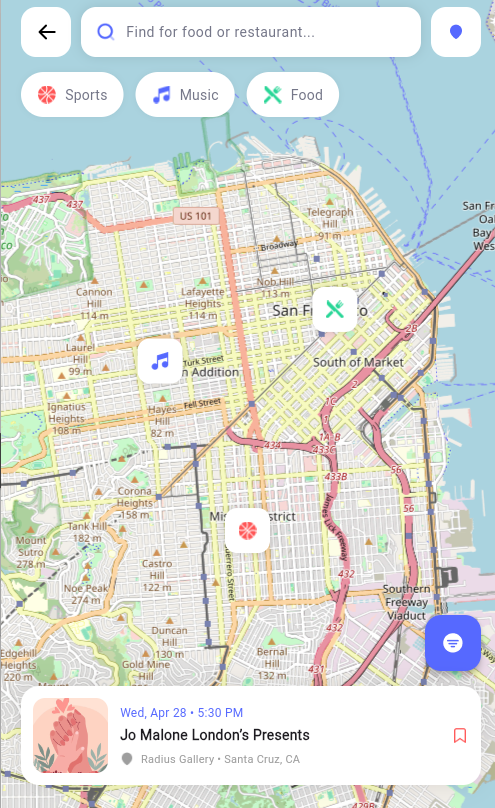

# 🌟 EventHub - Premium Event Discovery & Booking App

**EventHub** is a high-fidelity Flutter application that bridges the gap between professional UI/UX design and functional mobile engineering. This project is a comprehensive implementation of the professional **EventHub (Community)** design system from Figma, achieving **100% Pixel-Perfect** accuracy in layout, typography, and interactive components.

---

## 🎯 Design vs. Implementation (The Pixel-Perfect Challenge)

To demonstrate my commitment to detail, this section showcases a side-by-side comparison between the original **Figma design** and the **live Flutter app**.

| Feature | Figma Design System | My Flutter Implementation |
| :--- | :---: | :---: |
| **Home Dashboard** |  |  |
| **Advanced Filtering** |  |  |
| **Social Engagement** |  |  |
| **Event Details** |  |  |

---

## ✨ Key Features

- **User Authentication**: Seamless Sign-in/Sign-up flow with social login integration.
- **Event Discovery**: Advanced filtering by category (Sports, Music, Food), date, and price range.
- **Interactive Maps**: Real-time event location tracking using Google Maps API integration.
- **User Profiles**: Comprehensive profile management with event history and user interests.
- **Dynamic UI**: Beautifully crafted Bottom Sheets, Custom Drawers, and complex Gradients.

---

## 🛠 Tech Stack

- **Framework**: [Flutter](https://flutter.dev/) (Latest Version)
- **Language**: [Dart](https://dart.dev/)
- **State Management**: `StatefulWidget` (setState)
- **Design Source**: [EventHub (Community) - Figma](https://www.figma.com/community/file/1020352273410135111)

---

## 🖼️ App Gallery

<p align="center">
  
  
  
  
</p>

---

## 🚀 How to Run

1. **Clone the repo:**
   ```bash
   git clone [https://github.com/Ai-MAFlutter/flutter-event-hub-app.git](https://github.com/Ai-MAFlutter/flutter-event-hub-app.git)
